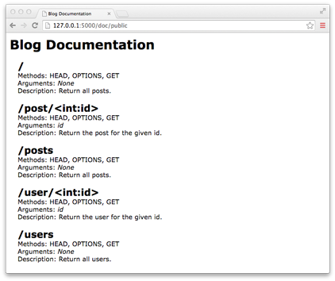
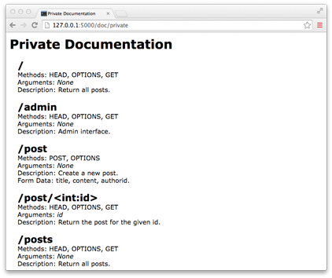

Flask-Selfdoc
=============

Flask-Selfdoc is a Flask extension that automatically creates documentation for your endpoints based on the routes, function arguments and docstrings. It was forked from Flask-Autodoc, written by Arnaud Coomans, and is completely compatible as a replacement for that extension.

## Requirements

Flask-Selfdoc is compatible with Python versions 2 and 3; and it depends only on Flask.

## Install

To install Flask-Selfdoc, run pip:

	pip install flask-selfdoc
	
or clone this directory and run setup:

    python setup.py install

## Usage

Start using Flask-Selfdoc by importing it and initializing it:

    from flask import Flask
    from flask_selfdoc import Autodoc

    app = Flask(__name__)
    auto = Autodoc(app)

by default, Flask-Selfdoc will only document the routes explicitly decorated with _doc_:

    @app.route('/user/<int:id>')
    @auto.doc()
    def show_user(id):
        return user_from_database(id)

to generate the documentation, use the _html()_ method:

    @app.route('/documentation')
    def documentation():
        return auto.html()

## Custom documentation

To access the documentation without rendering html:

    @app.route('/documentation')
    def documentation():
        return auto.generate()

the documentation will be returned as a list of rules, where each rule is a dictionary containing:

- methods: the set of allowed methods (ie ['GET', 'POST'])
- rule: relative url (ie '/user/<int:id>')
- endpoint: function name (ie 'show_user')
- doc: docstring of the function
- args: function arguments
- defaults: defaults values for the arguments

## Custom template

To use a custom template for your documentation, give a _template_ argument to the _html_ method. This will use a template from the flask _templates_ directory. 

Additional arguments (other than _group_, _groups_, and _template_) will be passed down to the template:

	auto.html(
		
		template='custom_documentation.html'
		
		title='My Documentation',
		author='John Doe',
	)
	

_title_ and _author_ will be available in the template:

	<!-- templates/custom_documentation.html -->
	...
	
		{{title}}
	
	...

## Documentation sets

Endpoints can be grouped together in different documentation sets. It is possible for instance to show some endpoints to third party developers and have full documentation for primary developers.

To assign an endpoint to a group, pass the name of the group as argument of the _doc_ decorator:

    @app.route('/user/<int:id>')
    @auto.doc('public')
    def show_user(id):

to assign an endpoint to multiple groups, pass a list of group names as the _groups_ argument to _doc_:

    @app.route('/user/<int:id>')
    @auto.doc(groups=['public','private'])
    def show_user(id):

to generate the documentation for a specific group, pass the name of the group to the _html_ or _generate_ methods:

    auto.html('public')
    auto.html(groups=['public','private'])
    auto.generate('public')
    
## Examples

Apps in the _examples_ directory are an api for a blog:

- _simple_ is a simple app
- _factory_ uses blueprints

Run with

	python simple/blog.py
	
and connect to [/doc/public](http://127.0.0.1:5000/doc/public) and [/doc/private](http://127.0.0.1:5000/doc/private) to see public and private documentations.

## Screenshots

